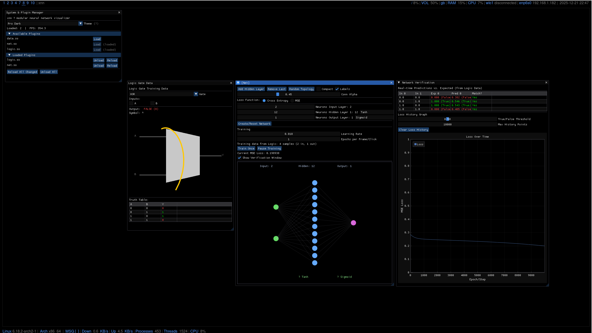
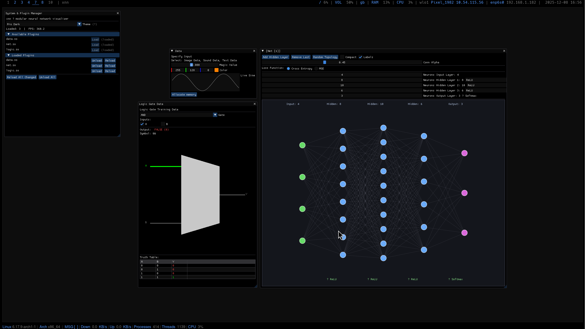
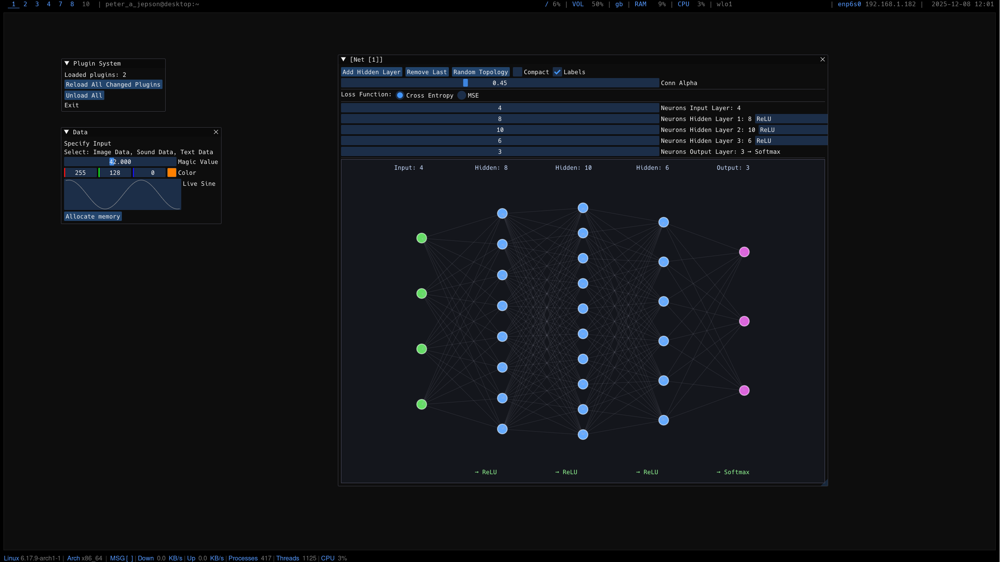
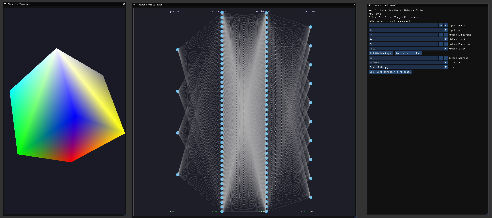

# xnn.h – Header-Only Neural Network in C

**Building xnn.c - Main Application**

## XNN - [X] Neural Network


````
````

````
````

```
```


```c
size_t arch[] = {784, 128, 10};
int act[] = {ACT_RELU, ACT_RELU, ACT_SOFTMAX};
Network *net = network_alloc(arch, 3, act, LOSS_CE);
XNN_INIT();
```

## XNN
```

Dependencies:
cd ./libs
    git clone https://github.com/ocornut/imgui.git
    git clone https://github.com/nothings/stb.git
    git clone https://github.com/epezent/implot.git

SYSTEM WIDE INSTALLATION!! - SDL2, GLFW
    ARCH -- sudo pacman -Syu glfw sdl2
    UBUNTU -- sudo apt update && sudo apt install libglfw3-dev libsdl2-dev
    FEDORA -- sudo dnf install glfw-devel SDL2-devel
```

## Features
```
Feature                 Status
------------------------------
Header-only             Yes
No dependencies         Yes
Activations             Sigmoid, Tanh, ReLU, Softmax
Loss                    MSE / Cross-Entropy
Initialization          Xavier / He
Mini-batch training     Yes
Gradient clipping       Yes
Save / load             Yes
CSV loader              Yes
Gradient-checked        Yes
MNIST 98.13%            Yes
```

## Quick Start
```
#define XNN_IMPLEMENTATION
#include "xnn.h"

int main() {
    XNN_INIT();

    Matrix *train = matrix_from_csv("mnist_train.csv", 60000, 785);
    Matrix *test  = matrix_from_csv("mnist_test.csv",  10000, 785);

    // Normalize + one-hot...
    // (see demos/mnist.c)

    size_t arch[] = {784, 128, 10};
    int act[] = {ACT_RELU, ACT_RELU, ACT_SOFTMAX};
    Network *net = network_alloc(arch, 3, act, LOSS_CE);
    Network *grad = network_alloc(arch, 3, act, LOSS_CE);

    // Train with mini-batches...
    // (see demos/mnist.c)

    network_save(net, "model.bin");
}
```
## Demos
```
test.c          Test Implementation   
mnist.c         Train mnist
mnist_draw.c    Load mnist model and visualize [SDL2]
char_rnn.c      Trains text (AI Generated)
image_xnn.c     Trains image data [SDL2 STB_IMAGE] (./images)
image_fourier.c Trains Image data (AI Generated) [SDL2 STB_IMAGE] (./images)
three.c         Trains three 14x14 ASCII images and interpolates between them [SDL2].
```
## API
```
Network *network_alloc(const size_t *arch, size_t n, const int *act, int loss);
void forward(Network *net);
void backprop(Network *net, Network *grad, const Data *data);
void apply_grad(Network *net, const Network *grad, float rate);
float network_mse(const Network *net, const Data *data);
void network_predict(const Network *net, const float *in, float *out);
int network_save(const Network *net, const char *path);
Network *network_load(const char *path, ...);
Matrix *matrix_from_csv(const char *path, size_t rows, size_t cols);
```
## Author

Peter A. Jepson – @modcraeft

## License

MIT License – see LICENSE
